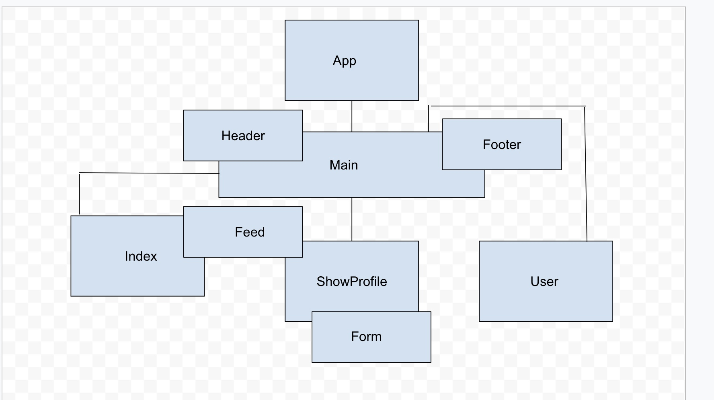

## MY Mern App 

- Frontend repo

# Product Requirements Documentation

**Summary**

| Field | Detail |
|--------|-----|
| Project Name | Mern  Example Project|
| Description | A website where users can interact with each other just like Twitter |
| Developers | Jonathan Pierre |
| Live Website Frontend | https://main--mellifluous-blini-249595.netlify.app/ |
| Live Website Backend | https://my-mern-app-jp.herokuapp.com/user |
| Repo Frontend| https://git.generalassemb.ly/jonwpierre/My-Mern-App-Frontend |
| Repo Backend|  https://git.generalassemb.ly/jonwpierre/My-Mern-App-backend |

## Technologies Used
- HTML5                  
- CSS3                   
- JavaScript             
- JQuery
- Express
- Node
- React 

## Problem Being Solved and Target Market
Users can now communicate with each other.

## User Stories
- Users should be able to do CRUD Operations with the posts 
- Users should be able to navigate to an user profile page to do crud operations on specific posts
- Users should be able to see all users feed on the site
- Users should be able to see their own personal feed on the site

## Screenshots

## Future Enhancements
- User Authentication
- Stored cookies and sessions
- Mobile Friendly
# My-Mern-App-JP
